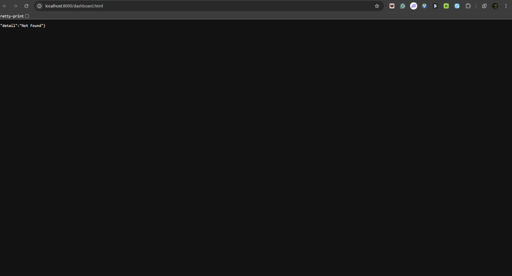
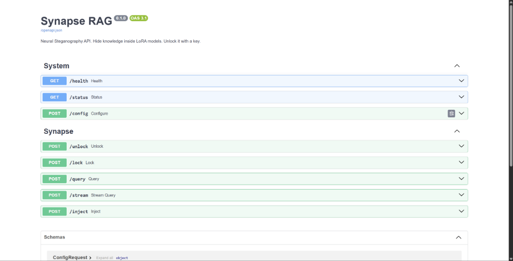

# Synapse RAG 🧠 
### *Neural Steganography for the LLM Era*

**Hide an entire knowledge base inside a standard AI weight file. No database. No cloud. Just a file and a key.**

---

### 🖼️ Visual Overview

| Dashboard (Locked vs Unlocked) | Headless API Docs |
| :---: | :---: |
|  |  |

---

## 🌟 The Vision
Synapse RAG turns AI model weights (specifically LoRA adapters) into **secure, deniable storage containers**. 

Most RAG systems require a complex infrastructure stack: Vector DBs, cloud storage, API gateways, and authentication layers. Synapse collapses this into a single file. Without the secret key, the file is a standard LoRA that appears to be random training noise. With the key, it unlocks a high-performance, local knowledge base.

> **Same File. Same Model. Different Reality.**

---

## 🚀 Key Features

*   **Deniable Steganography:** Knowledge is XOR-encrypted and scattered into the model's least significant bits (LSB). It is statistically indistinguishable from normal model weights.
*   **Zero-Infrastructure RAG:** The LoRA file *is* the database. No external dependencies are needed at runtime.
*   **Plug-and-Play AI:** Works with any OpenAI-compatible API (OpenRouter, Groq, Ollama), Gemini, and Anthropic.
*   **Parametric + Steganographic Hybrid:** Train models on public data and hide the "keys to the kingdom" in the steganographic layer.

---

## 🛠️ Ease of "Training" (The Forge-Inject Cycle)
One of the most powerful aspects of Synapse is that you don't need a GPU cluster to "train" knowledge into the model.

1.  **Forge:** Create a "Carrier" LoRA file (a mathematical skeleton) in seconds.
2.  **Inject:** Use our PRNG-scatter algorithm to bake your documents into the weights.
3.  **Serve:** Deploy the file. The AI only "sees" the data when the context is cryptographically unlocked in memory.

---

## 🎯 Use Cases

*   **Shadow Knowledge Bases:** Ship private company documentation (HR, protocols, internal specs) to a remote workforce. Even if the file is intercepted, the data is invisible.
*   **Deniable Communication:** Embed secret messages or operational codes inside seemingly innocent fine-tuned models shared on public hubs like HuggingFace.
*   **Secure SaaS Handoff:** Agencies can build a client's knowledge base, hand over the `.lora` file, and walk away. The client runs it locally; the agency never touches the client's data again.
*   **Legacy Data Capsule:** Archive sensitive historical data into model weights. It stays "alive" and queryable without needing a database server to stay online for a decade.

---

## 📖 How To Use

### 1. Installation
```bash
# Clone the repo and install
pip install -e .

# Or install with UI support
pip install -e ".[server]"
```

### 2. Core CLI Commands

**Step A: Forge a Carrier**  
Create a LoRA file with enough capacity for your data.
```bash
syn forge --size 500 --output aurora.lora
```

**Step B: Inject Data**  
Hide your text files or CSVs inside the carrier.
```bash
syn inject --lora aurora.lora --data ./vault/ --key your_secret_key
```

**Step C: Launch the Dashboard**  
Start the interactive server.
```bash
syn serve --backend openai --model gpt-4o-mini --lora aurora.lora
```

### 3. Using the Dashboard
1.  **Configure Model:** Set your OpenAI/OpenRouter key in the sidebar.
2.  **Unlock:** Enter your `Secret Key` and click **Unlock Context**.
3.  **Monitor:** Watch the **Activity Log** and **Context State**. When the "Locked" icon turns into a "Live" status, the AI is now reasoning using your hidden data.
4.  **Query:** Use the chat interface to ask questions. You can toggle the model lock at any time to see the difference between "Model Knowledge" vs "Steganographic Knowledge."

---

## 🛠️ Developer FAQ

### capacity vs. File Size
Steganography is about *hiding*, not *compressing*. We use repetition coding to survive weight quantization. To hide 1MB of text, you typically need a 100MB+ LoRA file to ensure the weight changes remain "below the noise floor."

### Can I use this with Quantized Models?
Yes! Synapse is designed to work with GGUF, EXL2, and AWQ models. The encryption survives even if the weights are crushed down to 4 bits.

### What happens if I lose my key?
The data is lost forever. There is no "master recovery" because the file is mathematically indistinguishable from random noise without the XOR salt derived from your key.

---

## 📜 License
MIT - *The knowledge was there all along.*

